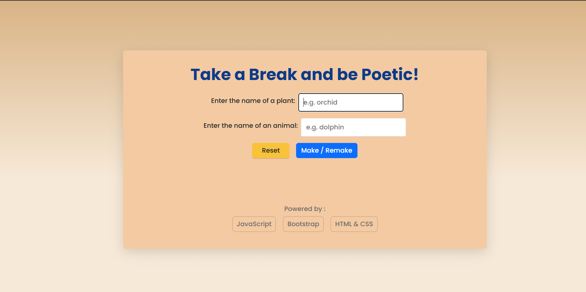
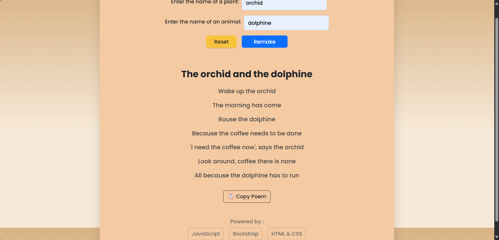

# Poem Generator
A simple and fun Poem Generator built with HTML, CSS, and JavaScript.
This project takes a plant/animal name as input and generates a short poem dynamically.

=> Live Demo

[View Project]( https://krishnaveni-techie.github.io/poem-generator/)

---

##  Features

-  Clean and simple UI  
-  Generates random poems based on input  
-  Copy-to-clipboard button  
-  Hosted with GitHub Pages  

---

##  Tech Stack

- **HTML5** → structure  
- **CSS3** → styling  
- **JavaScript (ES6)** → logic  

---

## Project Structure

poem-generator/
├── index.html
├── style.css
└── script.js

## Contributing

Pull requests are welcome! For major changes, please open an issue first to discuss what you’d like to change.

---

##  License

This project is licensed under the MIT License – feel free to use and modify.
